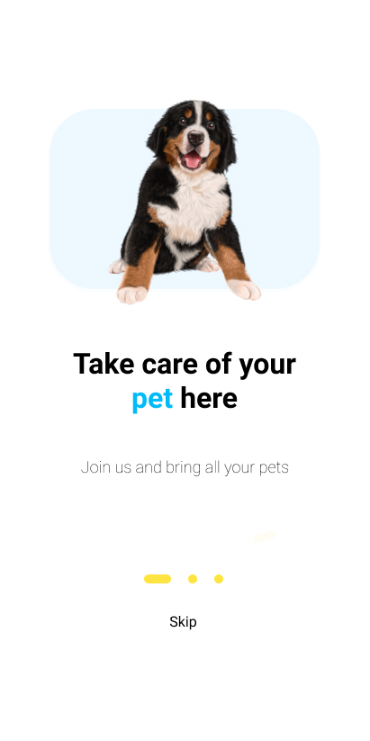

# MyPet

My pet is my first Android Application using Android Studio and Java.

It was designed by me and implemented as well all the interfaces and requests.

Using volley library as http client.

The back end is not posted, you must provide by yourself or update the application itself.

